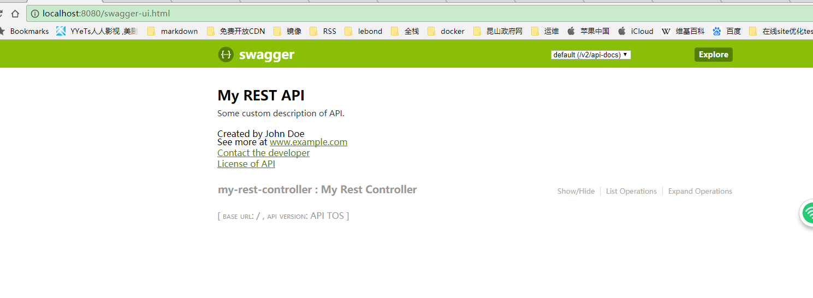

# springboot-actuator

 
## 什么是actuator
actuator是springboot提供的用来检测应用程序健康状态的东西，通过开启它，可以监测运行中的application,包括：

 * 健康 
 * 内存
 * app信息 
 * dump 
 * env 
 * etc. 

## 如何开启

在pom.xml中集成：

    <dependency>
        <groupId>org.springframework.boot</groupId>
        <artifactId>spring-boot-starter-actuator</artifactId>
        <version>1.4.2.RELEASE</version>
    </dependency>

添加后就会自动集成。

## 访问路径

以下有提供通用的访问端点：

* /health – 显示程序的健康信息， (如连接状态，授权信息，使用内存等).

* /info – 应用配置类属性

* /metrics – 获取应用程序运行过程中用于监控的度量指标，比如：内存信息、线程池信息、HTTP请求统计等。

* /trace：该端点用来返回基本的HTTP跟踪信息。默认情况下，跟踪信息的存储采用org.springframework.boot.actuate.trace.InMemoryTraceRepository实现的内存方式，始终保留最近的100条请求记录。它记录的内容格式如下：

* /dump：该端点用来暴露程序运行中的线程信息。它使用java.lang.management.ThreadMXBean的dumpAllThreads方法来返回所有含有同步信息的活动线程详情。

* /env：该端点与/configprops不同，它用来获取应用所有可用的环境属性报告。包括：环境变量、JVM属性、应用的配置配置、命令行中的参数。

* /beans：该端点用来获取应用上下文中创建的所有Bean

* /loggers: 显示或者修改logger配置接口

* /sessions: 允许检索和从session存储处删除session

* /shutdown: 实现应用程序优雅平滑关闭(默认这个接口是关闭的)

## 自定义实现一个优雅的重启endPoint

要求：先关闭，再启动springboot

[参考这篇文章](http://www.jianshu.com/p/bcebf8921919)

## 集成swagger-ui

为了方便调用接口我集成了swagger-ui，最新版本是3.6，目前springboot支持的集成版本是2.7.0,它的名字叫：`springfox-swagger2`

很简单，需要三步：

1. 添加maven依赖库

pom.xml:

    <!-- Swagger API文档 -->
		<dependency>
			<groupId>io.springfox</groupId>
			<artifactId>springfox-swagger-ui</artifactId>
			<version>2.7.0</version>
		</dependency>

		<dependency>
			<groupId>io.springfox</groupId>
			<artifactId>springfox-swagger2</artifactId>
			<version>2.7.0</version>
		</dependency>

2. 配置swagger的配置文件

SwaggerConfig.java:

    @Configuration
    @EnableSwagger2
    public class SwaggerConfig {
    
        @Bean
        public Docket api() {
            return new Docket(DocumentationType.SWAGGER_2)
                    .apiInfo(apiInfo())
                    .select()
                    .apis(RequestHandlerSelectors.basePackage("com.example.demo.controller"))
                    .paths(PathSelectors.ant("/rest/*"))
                    .build();
        }
    
        private ApiInfo apiInfo() {
            return new ApiInfo(
                    "My REST API",
                    "Some custom description of API.",
                    "API INFO",
                    "sam of service",
                    new Contact("sam.hu", "www.example.com", "myeaddress@company.com"),
                    "License of API", "API license URL", Collections.emptyList());
        }
    
    }

3. 配置webConfig

这步非常重要，2.7以前这一步是不需要的，但是2.7以后是需要配置，不然是找不到`swagger-ui.html`这个路径的。

WebConfig.java:

    @EnableWebMvc
    public class WebConfig extends WebMvcConfigurerAdapter {
    
    
        @Override
        public void addResourceHandlers(ResourceHandlerRegistry registry) {
            registry.addResourceHandler("swagger-ui.html")
                    .addResourceLocations("classpath:/META-INF/resources/");
    
            registry.addResourceHandler("/webjars/**")
                    .addResourceLocations("classpath:/META-INF/resources/webjars/");
        }
    }

然后启动springboot,访问：`http://localhost:8080/swagger-ui.html`

https://docs.spring.io/spring-boot/docs/2.0.0.M6/reference/htmlsingle/#boot-features-security-actuator
 